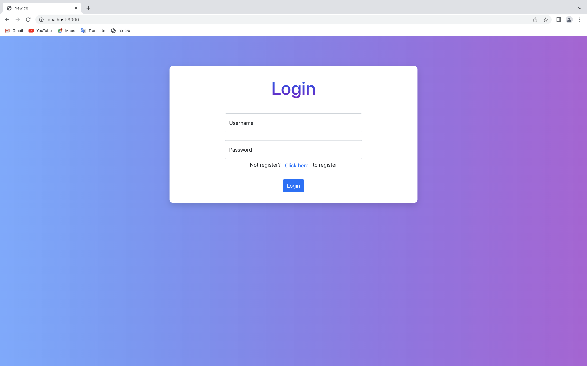
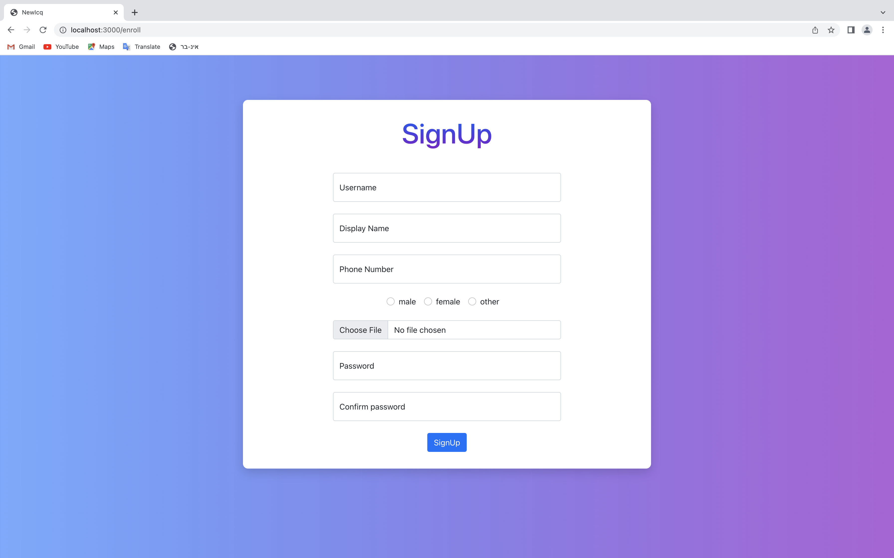

# AdvancedProgrammingWeb
This is a Web Client side of our chat application which is part of a bigger project for the course Advanced Programming 2.

## Description
The web client includes the following **pages**:
- **LogIn screen**

    

- **SignUp screen**

     

- **The Chats screen**


With the following **features**:
- Add new user to the app
- Connect to your app account
- Add new chat
- Sending a message from 4 different types: text, image, video and audio

## Technologies
- ReactJs
- Bootstrap
- HTML
- CSS
- JS

## Getting Started

### Dependencies
- react-router-dom 
- react-bootstrap-icons
- react-dom

### Installing & Executing program
Download the project and via your prefered IDE run the application.

We recommend on VSCode as an excellent IDE therefore we will explain how to run our project on this IDE.

After opening the project in VSCode, open VSCode Terminal. 

Make sure you are in the "newicq" folder, if not run the command:
```
cd newicq
```
Then run the following commands:

1)
```
npm install
```
(This command install all dependencies according to the package.json file in the project)

2)
```
npm start
```

After running this command the brwoser should open with the SignIn screen.

## Authors

Contributors names:

- Rotem Ghidale 
- Shir Fintsy
