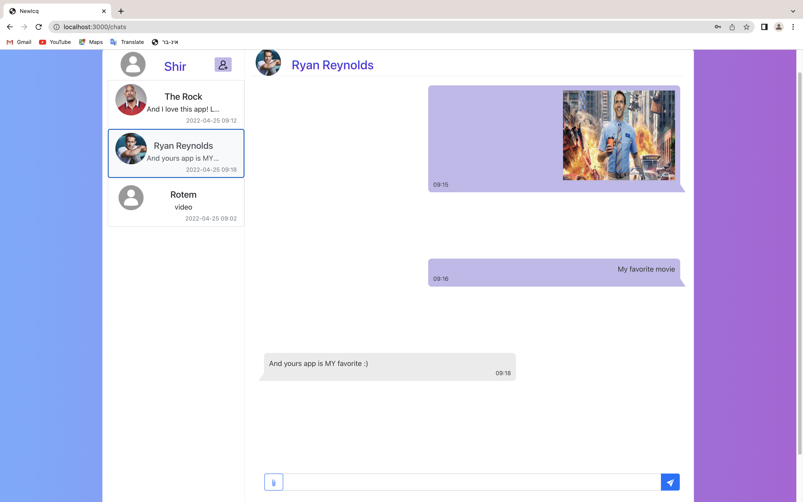
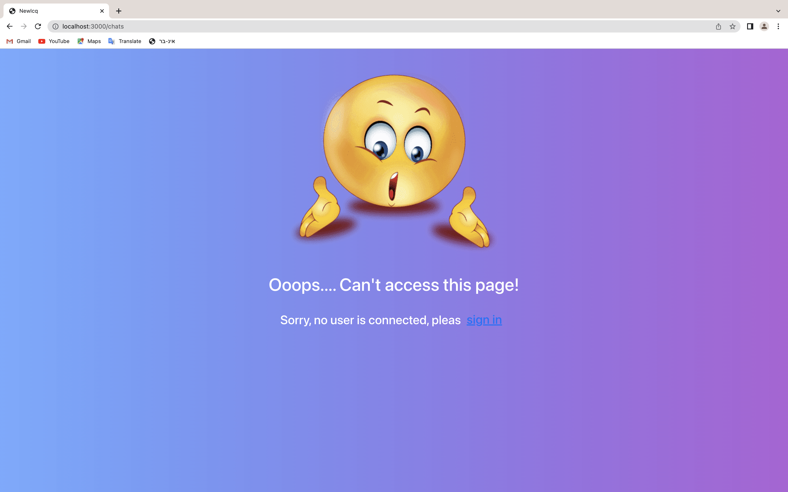

# AdvancedProgrammingWeb
This is a Web Client side of our chat application which is part of a bigger project for the course Advanced Programming 2.

## Description
The web client includes the following **pages**:
- **LogIn screen**

    

- **SignUp screen**

     

- **The Chats screen**

    

- **Error Access screen**

    


With the following **features**:
- Login to your user
- Rate the application
- Add new user to the app
- Connect to your app account
- Add new chat
- Sending a message from 4 different types: text, image, video and audio
- Enforce access restrictions
- Logout your user

## Technologies
- ReactJs
- Bootstrap
- HTML
- CSS
- JS
- SignalR

## Getting Started

### Dependencies
- react-router-dom 
- react-bootstrap-icons
- react-dom

### Installing & Executing program
At first, make sure that npm is installed on your computer. (you can download via Node.js installer)

Download the project and via your prefered IDE run the application.

We recommend on VSCode as an excellent IDE therefore we will explain how to run our project on this IDE.

In order to run the project with a server, you'll need to get the server program from "https://github.com/rotemg38/AdvancedProgrammingWebServerSide" and follow the instruction there. 

After tou run the server side, come back to VSCode and open VSCode Terminal. 

Make sure you are in the "newicq" folder, if not run the command:
```
cd newicq
```
And make sure to **delete package-lock.json file.**

Then run the following commands:

1)
```
npm install
```
(This command install all dependencies according to the package.json file in the project)

2)
```
npm start
```

After running this command the brwoser should open with the SignIn screen.

### Users Who Allready Registered

Main users with example of all messages type:
- **Username:** shir, **Password:** Shir1998
- **Username:** rotem, **Password:** Rotem100

Other users in the system:
- **Username:** rihanna
- **Username:** elon
- **Username:** ryan
- **Username:** dwayne johnson
- **Username:** obama

## Authors

Contributors names:

- Rotem Ghidale 
- Shir Fintsy
